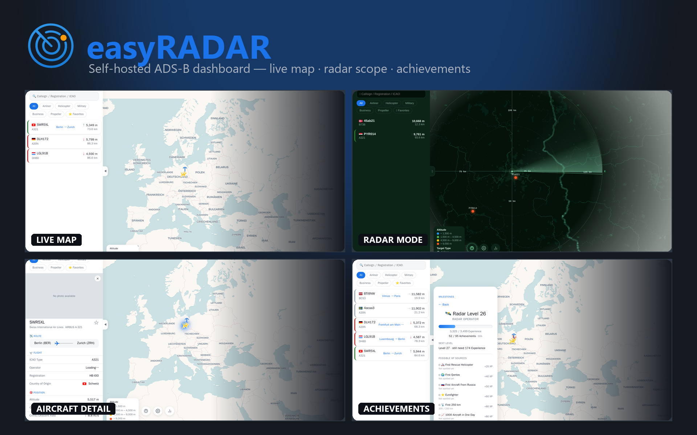

# easyRADAR



*[English](README.md)*

Selbstgehostetes ADS-B-Web-Dashboard auf Basis von [ultrafeeder](https://github.com/sdr-enthusiasts/docker-adsb-ultrafeeder) — eine Live-Flugzeugkarte, ein eigener kreisförmiger Radar-Modus und ein leichtgewichtiges Achievement-/Level-System fürs Entdecken verschiedener Flugzeugtypen, Airlines und Länder. Deutsch und Englisch von Haus aus.

## Screenshots

| Live-Karte | Radar-Modus |
|---|---|
|  |  |

| Detailansicht mit Route | Achievements & Radar-Level |
|---|---|
|  |  |

## Funktionen

- Live-Karte (Leaflet) mit höhenkodierten Flugzeugen, Filtern (Airliner/Helikopter/Militär/Business/Propeller/Favoriten) und durchsuchbarer Flugzeug-/Callsign-Liste
- **Radar-Modus** — ein eigener kreisförmiger PPI-Scope mit echtem Geländehintergrund, Sweep-Nachleuchten und Reichweitenringen, jederzeit umschaltbar
- **Achievements & Radar-Level** — XP fürs Entdecken neuer Flugzeugtypen, Airlines, Länder, seltener Flugzeuge, Höhen-/Reichweiten-/Nachrichtenrekorde, Tag-/Nacht-Muster und Jahrestage; Drilldown-Kategorieansicht, kein Account nötig (Fortschritt lebt im localStorage des Browsers)
- **Luftfahrt-Legenden-Galerie** — ein kleiner, XP-freier "Museums"-Bereich für historisch bedeutsame Flugzeuge, die live nie wieder empfangen werden können (Concorde, SR-71, ...)
- Deutsche/englische Oberfläche, merkt sich die Wahl, fällt sonst auf die Browsersprache zurück
- Installierbar als PWA
- Änderungsprotokoll direkt in der App

## Architektur

easyRADAR besteht aus zwei Diensten, die vor ein bestehendes ultrafeeder-/tar1090-Setup gesetzt werden:

| Komponente | Repo | Rolle |
|---|---|---|
| **radar-de** | dieses Repo | Statisches Frontend (`html/`) + `nginx.conf`, reverse-proxied `/data/` zu ultrafeeder, `/stats-api/` zu radar-stats, `/external/` zu opendata.adsb.fi, `/geocode/` zu Nominatim |
| **radar-stats** | eigenes Repo | Python-Dienst, der Achievements/XP/Rekorde anhand der Live-Daten von ultrafeeder verfolgt, Speicherung in SQLite |

Ein bestehender `ultrafeeder`-Container, der `/data/aircraft.json` und `/data/stats.json` im selben Docker-Netzwerk bereitstellt, wird vorausgesetzt — dieses Repo enthält kein Empfänger-/Decoder-Setup.

## Voraussetzungen

- Docker / Docker Compose
- Ein bestehender [ultrafeeder](https://github.com/sdr-enthusiasts/docker-adsb-ultrafeeder)-Container im selben Docker-Netzwerk, der `/data/aircraft.json` und `/data/stats.json` bereitstellt
- `radar-stats` (das begleitende Repo dieses Projekts) für Achievements/XP — optional, wenn nur Karte und Radar-Modus gewünscht sind

## Einrichtung

Kein Klonen nötig — einfach die veröffentlichten Images in eure Compose-Datei eintragen, neben dem bestehenden `ultrafeeder`-Dienst. Es werden sowohl `linux/amd64` als auch `linux/arm64` (Raspberry Pi) veröffentlicht.

1. Eine `site-config.js` neben eurer Compose-Datei anlegen, mit den Koordinaten des eigenen Empfängers:

   ```js
   const SITE_LAT = 52.5200, SITE_LON = 13.4050;
   ```

2. Den/die Dienst(e) hinzufügen:

   **Minimal** — nur Karte und Radar-Modus, ohne Achievements/XP:

   ```yaml
   services:
     easyradar:
       image: ghcr.io/unlieb/easyradar:latest
       container_name: easyradar
       restart: unless-stopped
       depends_on:
         - ultrafeeder
       ports:
         - 8087:80
       volumes:
         - ./site-config.js:/usr/share/nginx/html/site-config.js:ro
   ```

   **Vollständig** — ergänzt `radar-stats` für Achievements/XP/Radar-Level:

   ```yaml
   services:
     radar-stats:
       image: ghcr.io/unlieb/easyradar-stats:latest
       container_name: radar-stats
       restart: unless-stopped
       depends_on:
         - ultrafeeder
       environment:
         - TZ=Europe/Berlin
         - STATION_NAME=YourStationName
         - SITE_LAT=52.5200
         - SITE_LON=13.4050
       volumes:
         - radar-stats-data:/data

     easyradar:
       image: ghcr.io/unlieb/easyradar:latest
       container_name: easyradar
       restart: unless-stopped
       depends_on:
         - ultrafeeder
         - radar-stats
       ports:
         - 8087:80
       volumes:
         - ./site-config.js:/usr/share/nginx/html/site-config.js:ro

   volumes:
     radar-stats-data:
   ```

3. `docker compose up -d easyradar` (Minimal) bzw. `docker compose up -d radar-stats easyradar` (Vollständig), danach `http://<host>:8087/` öffnen.

### Alternativ: selbst aus dem Quellcode bauen

Wer den Code selbst anpassen möchte: dieses Repo (und `radar-stats`, für Vollständig) klonen, dann jeweils `docker build -t easyradar .` / `docker build -t radar-stats .`, und oben `image: ghcr.io/...` durch `build: ./radar-de` / `build: ./radar-stats` mit Pfad zum eigenen Klon ersetzen.

## Externe Dienste

easyRADAR ruft einige Drittanbieter-APIs direkt aus dem Browser auf — keine API-Keys nötig, alle frei/öffentlich:

| Dienst | Verwendung |
|---|---|
| [ADSBDB](https://www.adsbdb.com/) | Start-/Zielflughafen zu einem Callsign |
| [Planespotters.net](https://www.planespotters.net/) | Flugzeugfotos |
| [OpenStreetMap Nominatim](https://nominatim.org/) | Reverse-Geocoding für die Flugverlauf-Zeitleiste (über nginx mit eigenem User-Agent proxied) |
| [adsb.fi](https://adsb.fi/) | Optionale ergänzende Flugzeugdaten außerhalb der Reichweite des eigenen Empfängers |
| [CARTO](https://carto.com/) / [OpenStreetMap](https://www.openstreetmap.org/) | Kartenkacheln |

## Lizenz

MIT, siehe [LICENSE](LICENSE).
