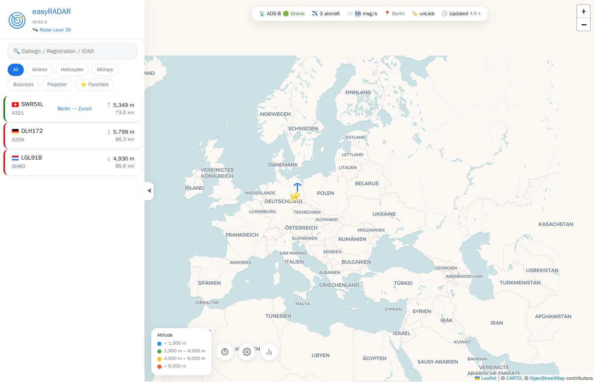
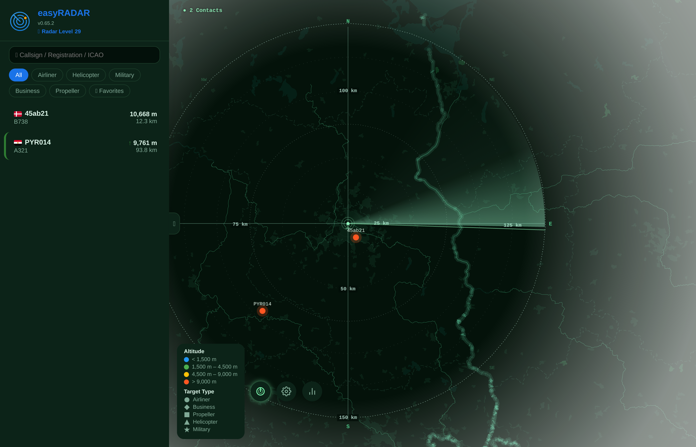
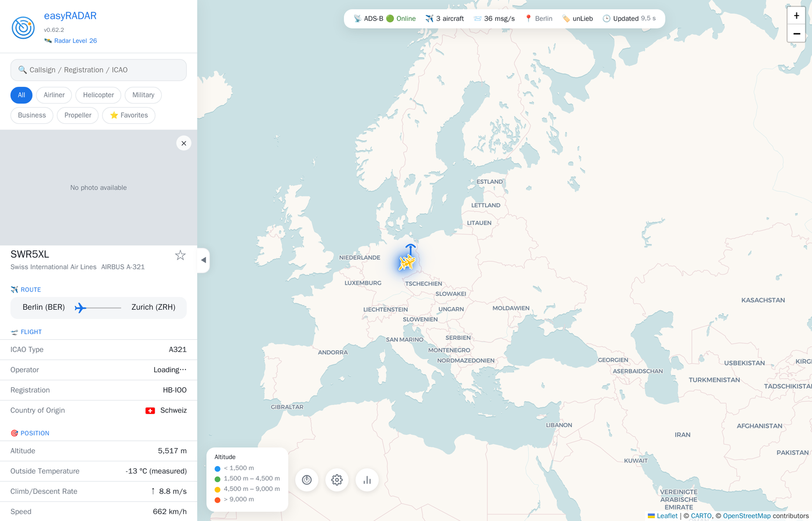
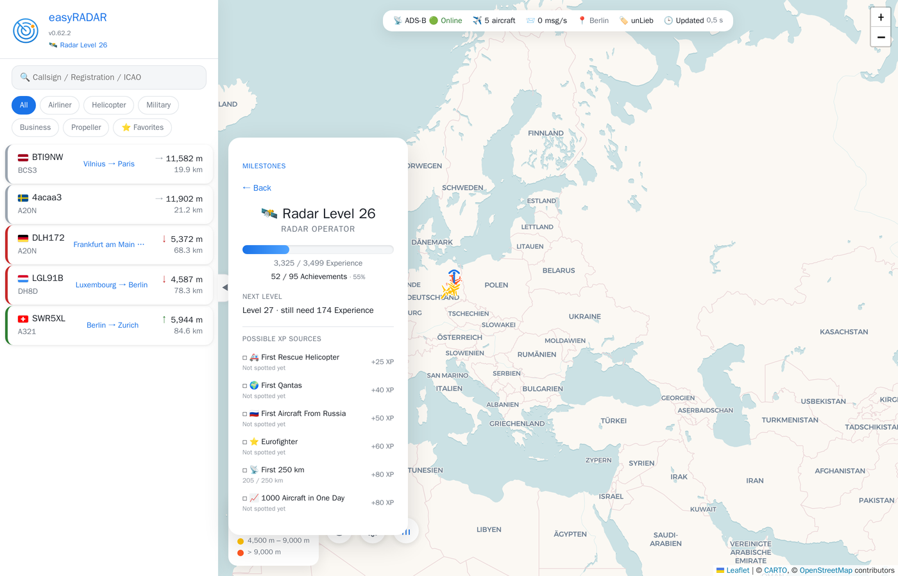

# easyRADAR

*[Deutsch](README.de.md)*

Self-hosted ADS-B web dashboard on top of [ultrafeeder](https://github.com/sdr-enthusiasts/docker-adsb-ultrafeeder) — a live aircraft map, a dedicated circular radar scope, and a lightweight achievement/leveling system for spotting different aircraft types, airlines, and countries. German and English out of the box.

## Screenshots

| Live map | Radar Mode |
|---|---|
|  |  |

| Aircraft detail with route | Achievements & Radar-Level |
|---|---|
|  |  |

## Features

- Live map (Leaflet) with altitude-colored aircraft, filters (airliner/helicopter/military/business/propeller/favorites), and a searchable aircraft/callsign list
- **Radar Mode** — a dedicated circular PPI-style scope with a real terrain background, sweep afterglow, and range rings, switchable at any time
- **Achievements & Radar-Level** — XP for spotting new aircraft types, airlines, countries, rare aircraft, altitude/range/message records, day/night patterns, and anniversaries; drill-down category view, no account needed (progress lives in the browser's localStorage)
- **Aviation Legends gallery** — a small, XP-free "museum" section for historically significant aircraft that can never be received live again (Concorde, SR-71, ...)
- German/English UI, remembers your choice, falls back to browser language
- Installable as a PWA
- In-app changelog

## Architecture

easyRADAR is two services sitting in front of an existing ultrafeeder/tar1090 setup:

| Component | Repo | Role |
|---|---|---|
| **radar-de** | this repo | Static frontend (`html/`) + `nginx.conf`, reverse-proxies `/data/` to ultrafeeder, `/stats-api/` to radar-stats, `/external/` to opendata.adsb.fi, `/geocode/` to Nominatim |
| **radar-stats** | separate repo | Python service tracking achievements/XP/records against ultrafeeder's live data, backed by SQLite |

You need an existing `ultrafeeder` container exposing `/data/aircraft.json` and `/data/stats.json` on the same Docker network — this repo does not include a receiver/decoder setup.

## Requirements

- Docker / Docker Compose
- An existing [ultrafeeder](https://github.com/sdr-enthusiasts/docker-adsb-ultrafeeder) container on the same Docker network, exposing `/data/aircraft.json` and `/data/stats.json`
- `radar-stats` (this project's companion repo) for achievements/XP - optional if you only want the map and radar scope

## Setup

1. Clone this repo and `radar-stats` as sibling directories next to your existing `docker-compose.yml`.
2. Copy `html/site-config.example.js` to `html/site-config.js` and set your own receiver's coordinates. That file is gitignored — it's meant to stay local to your deployment, never committed.
3. Add both services to your compose file, alongside your existing `ultrafeeder` service:

   ```yaml
   services:
     radar-stats:
       image: python:3-alpine
       container_name: radar-stats
       restart: unless-stopped
       depends_on:
         - ultrafeeder
       environment:
         - TZ=Europe/Berlin
         - STATION_NAME=YourStationName
         - SITE_LAT=52.5200
         - SITE_LON=13.4050
       volumes:
         - ./radar-stats/stats-service.py:/app/stats-service.py:ro
         - ./radar-stats/data:/data
       command: python3 /app/stats-service.py

     easyradar:
       image: nginx:alpine
       container_name: easyradar
       restart: unless-stopped
       depends_on:
         - ultrafeeder
         - radar-stats
       ports:
         - 8087:80
       volumes:
         - ./radar-de/html:/usr/share/nginx/html:ro
         - ./radar-de/nginx.conf:/etc/nginx/conf.d/default.conf:ro
   ```

4. `docker compose up -d radar-stats easyradar`, then open `http://<host>:8087/`.

## External Services

easyRADAR calls a few third-party APIs directly from the browser - no API keys needed, all free/public:

| Service | Used for |
|---|---|
| [ADSBDB](https://www.adsbdb.com/) | Origin/destination for a callsign |
| [Planespotters.net](https://www.planespotters.net/) | Aircraft photos |
| [OpenStreetMap Nominatim](https://nominatim.org/) | Reverse-geocoding the flight timeline (proxied through nginx with a proper User-Agent) |
| [adsb.fi](https://adsb.fi/) | Optional supplementary aircraft data outside your own receiver's range |
| [CARTO](https://carto.com/) / [OpenStreetMap](https://www.openstreetmap.org/) | Base map tiles |

## License

MIT, see [LICENSE](LICENSE).
